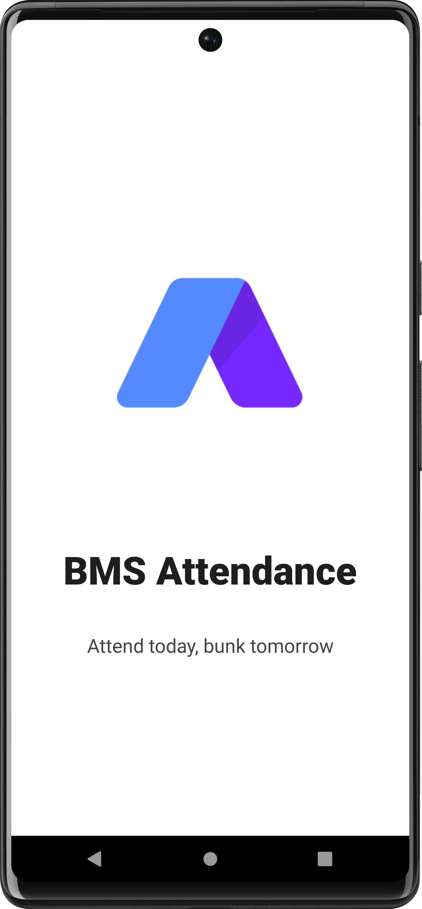

# ⚡Android 2 - Attendance App

This project is an Attendance Application built using Android for the faculties of the Information Science Department, BMS College of Engineering.
This project was made in collaboration with @whorahulnayak
## Screenshots

## Use Case Diagram
## Program Flow
## Tech Stack

- Java, XML

- Realm DB

## Features

An Android Application to track attendance of students by a Professor.
- Create classrooms
- Manage students in classrooms
- Mark attendance for a particular day
- Review attendance of previous days
- Students can check their attendance percentage
- Student details such as Name, Roll No, Phone No are stored
